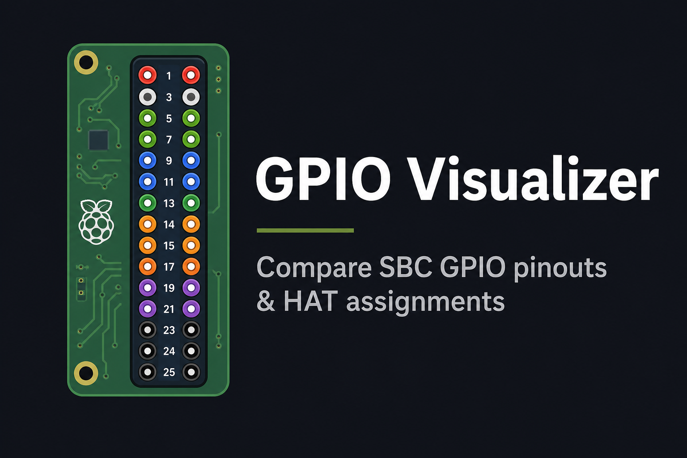

# GPIO Visualizer

[](https://t-rex-xp.github.io/sbc-gpio-helper/)
[](https://github.com/T-REX-XP/sbc-gpio-helper/actions/workflows/deploy-pages.yml)
[](https://github.com/T-REX-XP/sbc-gpio-helper/actions/workflows/ci.yml)
[](https://react.dev/)
[](https://www.typescriptlang.org/)
[](https://vite.dev/)

> Compare SBC GPIO pinouts and HAT assignments — side by side, in the browser.



**[Open live demo →](https://t-rex-xp.github.io/sbc-gpio-helper/)** · [Report an issue](https://github.com/T-REX-XP/sbc-gpio-helper/issues) · [View source](https://github.com/T-REX-XP/sbc-gpio-helper)

---

## Table of contents

- [Overview](#overview)
- [Features](#features)
- [Supported hardware](#supported-hardware)
- [Quick start](#quick-start)
- [Deployment](#deployment)
- [Configuration](#configuration)
- [Project structure](#project-structure)
- [Scripts](#scripts)
- [Documentation](#documentation)
- [License](#license)

---

## Overview

GPIO Visualizer is a static web app for exploring **40-pin and 26-pin GPIO headers** on single-board computers (SBCs) and how **display HATs** use those pins.

Pick a board platform, optionally stack a HAT, and inspect pin types, conflicts, and SPI routing. Compare two boards or two HATs to spot power, ground, and signal differences before you wire anything up.

| | |
|---|---|
| **Status** | Production — deployed to GitHub Pages on every push to `main` / `master` |
| **Languages** | English, Ukrainian (UI) |
| **Analytics** | Optional [Umami](docs/analytics.md) (privacy-friendly, no cookies) |
| **Data format** | JSON registry + per-platform pinout files — no backend required |

---

## Features

| Feature | Description |
|---------|-------------|
| **Interactive GPIO header** | Color-coded 26/40-pin layout with hover details, pin selection, and legend filters |
| **HAT overlay** | See which pins a display HAT uses; highlight conflicts when two HATs share signals |
| **Platform compare** | Side-by-side headers, pin-by-pin diff table, SPI bus view, and PCB form-factor diagram |
| **SPI visualization** | Bus signal mapping with chip-select lines per platform |
| **Device-tree overlays** | Radxa kernel overlay reference (from official wiki/docs) |
| **Hardware registry** | Filterable catalog of registered SBCs and HATs with expandable specs |
| **Shareable URLs** | Deep links for platform, compare target, HAT, filters, selected pins, and active tab |
| **Export pinout** | Copy or save GPIO sections as PNG |
| **Responsive layout** | Adapts header density for 26-pin vs 40-pin boards |

### Example URLs

```text
/board/raspberry-pi-40pin?hat=waveshare-lcd-1.3&view=spi&pins=3,5
/registry?category=hats&expand=waveshare-lcd-1.3
```

---

## Supported hardware

Data lives in [`src/config/hardware-registry.json`](src/config/hardware-registry.json), [`src/config/wiringop-sbcs.json`](src/config/wiringop-sbcs.json), [`src/config/wiringx-sbcs.json`](src/config/wiringx-sbcs.json), and [`src/config/platforms/`](src/config/platforms/). The [hardware registry](https://t-rex-xp.github.io/sbc-gpio-helper/registry) page lists every entry with filters and specs.

Catalog totals: **70 SBCs** · **4 HATs** · **5 GPIO libraries** · **48 pinout profiles**

### Curated SBCs

| Board | Header | GPIO numbering | SoC |
|-------|--------|----------------|-----|
| Raspberry Pi | 40-pin | BCM | Broadcom BCM2711 / BCM2837 / BCM2835 |
| Radxa Zero | 40-pin | Linux GPIO + bank name | Amlogic S905Y2 |
| Radxa Zero 3 | 40-pin | Linux GPIO + bank name | Rockchip RK3566 |
| Orange Pi Zero 3W | 40-pin | SoC port name (PB/PE/PL/PD) | Allwinner A733 |
| Orange Pi 5 | 26-pin | Linux GPIO + bank name (GPIOx_YZ) | Rockchip RK3588S |
| Luckfox Lyra Zero W | 40-pin | Rockchip GPIO + RM_IO | Rockchip RK3506B |
| Luckfox Aura | 40-pin | Rockchip GPIO bank name | Rockchip RV1126B |
| Cubie A7Z | 40-pin | SoC port name (PB/PJ/PD/PL/PM) | Allwinner A733 |
| Cubie A7S | 30-pin (+ separate 15-pin header) | SoC port name (PB/PJ/PD/PL/PM/PG) | Allwinner A733 |

### Orange Pi (50 boards, [wiringOP](https://github.com/orangepi-xunlong/wiringOP))

Imported from wiringOP `piBoardId()` release strings. Pinouts use wiringOP wPi numbering where documented in the wiringOP README; newer boards may use placeholder profiles until `gpio readall` data is available.

- Orange Pi 3 (26-pin, Allwinner H6)
- Orange Pi 3 LTS (26-pin, Allwinner H6)
- Orange Pi 3 Plus (40-pin, Allwinner H618)
- Orange Pi 3B (40-pin, Allwinner H618)
- Orange Pi 4 (40-pin, Rockchip RK3399)
- Orange Pi 4 LTS (40-pin, Rockchip RK3399)
- Orange Pi 4 Pro (40-pin, Allwinner T527)
- Orange Pi 4A (40-pin, Allwinner T527)
- Orange Pi 5 Max (26-pin, Rockchip RK3588)
- Orange Pi 5 Plus (40-pin, Rockchip RK3588)
- Orange Pi 5 Pro (26-pin, Rockchip RK3588S)
- Orange Pi 5 Ultra (26-pin, Rockchip RK3588)
- Orange Pi 5B (26-pin, Rockchip RK3588)
- Orange Pi 800 (40-pin, Rockchip RK3399)
- Orange Pi 900 (40-pin, Rockchip RK3588)
- Orange Pi AI Max (26-pin, Rockchip RK3588)
- Orange Pi AI Pro (40-pin, Rockchip RK3588)
- Orange Pi AI Pro 20T (40-pin, Rockchip RK3588)
- Orange Pi AI Station (40-pin, Rockchip RK3588)
- Orange Pi CM4 (40-pin, Rockchip RK3566)
- Orange Pi CM5 (26-pin, Rockchip RK3588)
- Orange Pi CM5 Tablet (26-pin, Rockchip RK3588)
- Orange Pi Kunpeng Pro (40-pin, Huawei Kunpeng)
- Orange Pi Lite (40-pin, Allwinner H3)
- Orange Pi Lite 2 (26-pin, Allwinner H6)
- Orange Pi One (40-pin, Allwinner H3)
- Orange Pi One Plus (26-pin, Allwinner H6)
- Orange Pi PC (40-pin, Allwinner H3)
- Orange Pi PC 2 (40-pin, Allwinner H5)
- Orange Pi PC Plus (40-pin, Allwinner H3)
- Orange Pi Plus (40-pin, Allwinner H3)
- Orange Pi Plus 2E (40-pin, Allwinner H3)
- Orange Pi Prime (40-pin, Allwinner H5)
- Orange Pi R1 (26-pin, Allwinner H2+)
- Orange Pi R1 Plus (26-pin, Rockchip RK3328)
- Orange Pi R1 Plus LTS (26-pin, Rockchip RK3328)
- Orange Pi RK3399 (40-pin, Rockchip RK3399)
- Orange Pi RV (40-pin, Allwinner T113)
- Orange Pi RV2 (40-pin, Allwinner T113)
- Orange Pi Win (40-pin, Allwinner A64)
- Orange Pi Win Plus (40-pin, Allwinner A64)
- Orange Pi Zero (26-pin, Allwinner H2+)
- Orange Pi Zero 2 (26-pin, Allwinner H616)
- Orange Pi Zero 2W (26-pin, Allwinner H616)
- Orange Pi Zero 3 (26-pin, Allwinner H616)
- Orange Pi Zero 3 Plus (40-pin, Allwinner H618)
- Orange Pi Zero LTS (26-pin, Allwinner H2+)
- Orange Pi Zero Plus (26-pin, Allwinner H5)
- Orange Pi Zero Plus 2 (H3) (26-pin, Allwinner H3 / H5)
- Orange Pi Zero Plus 2 (H5) (26-pin, Allwinner H3 / H5)

Also supported via wiringOP/wiringX metadata on curated entries: **Orange Pi Zero 3W**, **Orange Pi 5**, **Orange Pi PC Plus**, **Orange Pi PC 2**, and **Raspberry Pi** (40-pin models including Pi 1A+/2/3/4/Zero for wiringX).

### Other SBCs ([wiringX](https://manual.wiringx.org/) manual)

**Banana Pi**

- BananaPi 1 (26-pin, Allwinner A10)
- BananaPi M2 (40-pin, Allwinner A31s)

**Hardkernel**

- Odroid C1 (40-pin, Amlogic S805)
- Odroid C2 (40-pin, Amlogic S905)
- Odroid XU4 (30-pin, Samsung Exynos 5422)

**LinkSprite**

- PCDuino 1 (40-pin, Allwinner A10)

**Radxa**

- Radxa ROCK 4 Series (40-pin, Rockchip RK3399 variants)

**Raspberry Pi**

- Raspberry Pi 1A and B Revision 1 (26-pin, Broadcom BCM2835)
- Raspberry Pi 1A and B Revision 2 (26-pin, Broadcom BCM2835)

**SolidRun**

- Hummingboard Base / Pro (26-pin, NXP i.MX6)
- Hummingboard Edge / Gate (40-pin, NXP i.MX6)

### Display HATs

| HAT | Vendor | Platform | Interface |
|-----|--------|----------|-----------|
| 2.13″ e-Paper HAT | Waveshare | raspberry-pi-40pin | SPI |
| 1.3″ LCD HAT | Waveshare | raspberry-pi-40pin | SPI |
| 1.44″ LCD HAT | Waveshare | raspberry-pi-40pin | SPI |
| 1.3″ OLED HAT | Waveshare | raspberry-pi-40pin | SPI, I2C |

### Supported GPIO libraries

The [hardware registry](https://t-rex-xp.github.io/sbc-gpio-helper/registry?category=libraries) lists each library with maintainer, languages, and which pinout profiles in this project are tagged as compatible.

| Library | Languages | WiringPi API | Pinout profiles |
|---------|-----------|--------------|-----------------|
| [WiringPi](https://github.com/WiringPi/WiringPi) | C, C++, Python | High | 1 |
| [WiringOP](https://github.com/orangepi-xunlong/wiringOP) | C, C++, Python | High | 29 |
| [wiringX](https://github.com/wiringX/wiringX) | C, Python | Moderate | 14 |
| [Eclipse MRAA (libmraa)](https://github.com/eclipse-mraa/mraa) | C, C++, Python, Java, Node.js | Low | 2 |
| [libgpiod](https://git.kernel.org/pub/scm/libs/libgpiod/libgpiod.git) | C, C++, Python, Rust | None | 9 |

#### WiringPi

Unofficial community continuation of Gordon Henderson's original WiringPi. High performance comes from direct Broadcom and RP1 register access via DMA. Supports Raspberry Pi models through Pi 5 only — architecturally incompatible with Allwinner (Orange Pi) and Rockchip (Radxa) SoCs.

- **Maintainer:** Community (WiringPi/WiringPi)
- **Primary targets:** Raspberry Pi
- **Languages:** C, C++, Python
- **WiringPi API compatibility:** High
- **Best for:** Native Raspberry Pi GPIO with the classic WiringPi API (wiringPiSetup, digitalWrite, BCM numbering).
- **Documentation:** [https://github.com/WiringPi/WiringPi](https://github.com/WiringPi/WiringPi)
- **Supported pinout profiles (1):** `raspberry-pi-40pin`

#### WiringOP

Direct fork of WiringPi modified for Orange Pi boards with Allwinner and Rockchip SoCs. Keeps the same API surface as WiringPi, making it the easiest drop-in replacement when porting existing Raspberry Pi C/C++ code to Orange Pi.

- **Maintainer:** Orange Pi (orangepi-xunlong)
- **Primary targets:** Orange Pi (Allwinner / Rockchip)
- **Languages:** C, C++, Python
- **WiringPi API compatibility:** High
- **Best for:** Porting legacy Raspberry Pi WiringPi code to Orange Pi with minimal rewrites.
- **Documentation:** [https://github.com/orangepi-xunlong/wiringOP](https://github.com/orangepi-xunlong/wiringOP)
- **Python bindings:** [https://github.com/orangepi-xunlong/wiringOP-Python](https://github.com/orangepi-xunlong/wiringOP-Python)
- **Notes:** 60 Orange Pi boards detected from wiringOP piBoardId() release strings. Pinouts from wiringOP gpio readall where documented.
- **Supported pinout profiles (29):** `orangepi-3b-40pin`, `orangepi-3plus-40pin`, `orangepi-4a-40pin`, `orangepi-4pro-40pin`, `orangepi-5-26pin`, `orangepi-5plus-40pin`, `orangepi-800-40pin`, `orangepi-900-40pin`, `orangepi-a64-40pin-win`, `orangepi-aipro-40pin`, `orangepi-aistation-40pin`, `orangepi-cm4-40pin`, `orangepi-h2-26pin`, `orangepi-h3-26pin-zero-plus-2`, `orangepi-h3-40pin`, `orangepi-h5-26pin-zero-plus`, `orangepi-h5-40pin-pc2`, `orangepi-h5-40pin-prime`, `orangepi-h6-26pin-3`, `orangepi-h6-26pin-lite2`, `orangepi-h616-26pin-zero2`, `orangepi-kunpeng-pro-40pin`, `orangepi-r1-plus-26pin`, `orangepi-rk3399-40pin`, `orangepi-rk3399-40pin-4`, `orangepi-rv-40pin`, `orangepi-rv2-40pin`, `orangepi-zero-3-plus-40pin`, `orangepi-zero-3w-40pin`

#### wiringX

Modular, hardware-agnostic GPIO library with a uniform API across Raspberry Pi, Radxa, Orange Pi, Banana Pi, ODROID, and other Linux SBCs. Auto-detects the host platform at runtime so the same program can target multiple boards.

- **Maintainer:** wiringX project
- **Primary targets:** Radxa, Orange Pi, Banana Pi, ODROID, Raspberry Pi
- **Languages:** C, Python
- **WiringPi API compatibility:** Moderate
- **Best for:** Cross-platform C/Python projects that must run on several alternative SBC families with one codebase.
- **Documentation:** [https://manual.wiringx.org](https://manual.wiringx.org)
- **Notes:** 18 boards from wiringX 7.0 manual — merged with existing catalog entries where duplicated.
- **Supported pinout profiles (14):** `bananapi-1-26pin`, `bananapi-m2-40pin`, `hummingboard-base-pro-26pin`, `hummingboard-edge-gate-40pin`, `odroid-c1-40pin`, `odroid-c2-40pin`, `odroid-xu4-30pin`, `orangepi-h3-40pin`, `orangepi-h5-40pin-pc2`, `pcduino-1-40pin`, `radxa-rock4-40pin`, `raspberry-pi-26pin-rev1`, `raspberry-pi-26pin-rev2`, `raspberry-pi-40pin`

#### Eclipse MRAA (libmraa)

Robust C/C++ hardware abstraction layer with official bindings for Python, Node.js, and Java. Detects the board at runtime and exposes GPIO, I²C, SPI, UART, and PWM through a portable API unrelated to WiringPi syntax.

- **Maintainer:** Eclipse IoT (eclipse-mraa)
- **Primary targets:** Raspberry Pi, Radxa, Orange Pi Prime, x86 SBCs
- **Languages:** C, C++, Python, Java, Node.js
- **WiringPi API compatibility:** Low
- **Best for:** Enterprise or multi-language projects needing runtime board detection and a stable abstraction layer beyond WiringPi.
- **Documentation:** [https://github.com/eclipse-mraa/mraa#supported-platforms](https://github.com/eclipse-mraa/mraa#supported-platforms)
- **Notes:** Board files exist for Radxa ZERO 3 and Raspberry Pi; other registered platforms may work via generic Linux GPIO but are not officially documented in MRAA.
- **Supported pinout profiles (2):** `raspberry-pi-40pin`, `radxa-zero-3-40pin`

#### libgpiod

Modern Linux standard for GPIO access through the gpiochip character device (/dev/gpiochip*). Works on any board running a recent Linux kernel with GPIO chardev support — no WiringPi-style API, but the recommended kernel-native approach.

- **Maintainer:** Linux GPIO subsystem (kernel.org)
- **Primary targets:** Any modern Linux SBC
- **Languages:** C, C++, Python, Rust
- **WiringPi API compatibility:** None (kernel gpiochip API)
- **Best for:** Future-proof Linux GPIO development using the official kernel character-device interface instead of legacy WiringPi syntax.
- **Documentation:** [https://libgpiod.readthedocs.io/](https://libgpiod.readthedocs.io/)
- **GitHub mirror:** [https://github.com/brgl/libgpiod](https://github.com/brgl/libgpiod)
- **Supported pinout profiles (9):** `raspberry-pi-40pin`, `radxa-zero-40pin`, `radxa-zero-3-40pin`, `orangepi-zero-3w-40pin`, `orangepi-5-26pin`, `luckfox-lyra-zero-w-40pin`, `luckfox-aura-40pin`, `cubie-a7z-40pin`, `cubie-a7s-30pin`

### Pinout profiles (48)

Each JSON file under [`src/config/platforms/`](src/config/platforms/) defines physical pin layout, SPI buses, and PCB form factor. Multiple SBCs can share one profile (for example, several Orange Pi H3 boards use `orangepi-h3-40pin.json`).

- **Orange Pi / wiringOP:** 30 profiles
- **Other vendors:** 18 profiles — Banana Pi, Cubie, Hummingboard, Luckfox, Odroid, PCDuino, Radxa, Raspberry Pi

Pull requests to add boards, HATs, or pinout corrections are welcome. Regenerate import data with `npm run import:wiringop` / `npm run import:wiringx`; refresh device and library lists with `node scripts/print-readme-hardware.mjs`.

---

## Quick start

### Prerequisites

- **Node.js** 20+ (22 recommended — matches CI)
- **npm** 10+

### Local development

```bash
git clone https://github.com/T-REX-XP/sbc-gpio-helper.git
cd sbc-gpio-helper
npm install
npm run dev
```

Open the URL shown in the terminal (usually `http://localhost:5173`).

### Production build

```bash
npm run build
npm run preview
```

Output is written to `dist/`.

---

## Deployment

The app is built for **[GitHub Pages](https://pages.github.com/)** via GitHub Actions.

1. In the repository: **Settings → Pages → Build and deployment → Source: GitHub Actions**
2. Push to `main` or `master` — the [Deploy GitHub Pages](.github/workflows/deploy-pages.yml) workflow publishes automatically.

```text
https://<username>.github.io/<repository-name>/
```

This repository: **https://t-rex-xp.github.io/sbc-gpio-helper/**

| Topic | Guide |
|-------|-------|
| Pages setup, base path, custom domain | [docs/deployment.md](docs/deployment.md) |
| Social preview (Open Graph / Twitter Card) | [docs/deployment.md#social-preview-open-graph--twitter-card](docs/deployment.md#social-preview-open-graph--twitter-card) |
| Local Pages build test | `npm run build:pages` then `npm run preview` |

---

## Configuration

### Hardware registry

| File | Purpose |
|------|---------|
| [`src/config/hardware-registry.json`](src/config/hardware-registry.json) | SBC and HAT catalog (`sbcs`, `hats`) |
| [`src/config/platforms/*.json`](src/config/platforms/) | Pinout, SPI buses, form factor per platform |
| [`public/sbcs/`](public/sbcs/) | Board thumbnail images |

### Environment variables

Copy [`.env.example`](.env.example) to `.env` for local development. In CI, set variables on the `github-pages` environment.

| Variable | Required | Description |
|----------|:--------:|-------------|
| `VITE_UMAMI_WEBSITE_ID` | No | Umami website ID; omit to disable analytics |
| `VITE_UMAMI_SCRIPT_URL` | No | Umami script URL (default: Umami Cloud) |
| `VITE_SITE_URL` | No | Public site URL for Open Graph tags (auto-detected on GitHub Actions) |
| `VITE_BASE_PATH` | No | Override Vite base path (custom domain / subpath) |

See [docs/analytics.md](docs/analytics.md) for Umami setup.

---

## Project structure

```text
src/
  analytics/          # Umami integration
  components/         # UI (GPIO header, selectors, registry table, …)
  config/             # Hardware registry, platform JSON, site metadata
  hardware/           # Registry logic, SPI, pin labels, comparison
  i18n/               # English + Ukrainian strings
  layout/             # App shell and navigation
  pages/              # Main visualizer + registry page
  routing/            # URL state (board, registry, shareable params)
  utils/              # Public URL helper, image export
docs/
  requirement.md      # Original product requirements
  analytics.md        # Umami analytics guide
  deployment.md       # GitHub Pages pipeline and hosting
public/
  og-image.png        # Social preview image (1200×630, generated from Pi pinout)
  og-image.svg        # Source SVG for og-image.png
  logo.svg            # App logo and apple-touch-icon
  sbcs/               # SBC thumbnail images
.github/workflows/
  ci.yml              # Lint + build on push/PR
  deploy-pages.yml    # Build and deploy to GitHub Pages
```

---

## Scripts

| Command | Description |
|---------|-------------|
| `npm run dev` | Start Vite dev server with hot reload |
| `npm run build` | Typecheck (`tsc`) + production build to `dist/` |
| `npm run build:pages` | Build with GitHub Pages base path (local test) |
| `npm run generate:og-image` | Regenerate `public/og-image.png` from Raspberry Pi pinout data |
| `npm run generate:sbc-images` | Generate WebP thumbnails for SBCs without a product photo |
| `npm run import:wiringop` | Import Orange Pi boards from [wiringOP](https://github.com/orangepi-xunlong/wiringOP) |
| `npm run import:wiringx` | Import boards from [wiringX manual](https://manual.wiringx.org/) (merges with existing entries) |
| `node scripts/print-readme-hardware.mjs` | Print supported-device and GPIO-library markdown for README (stdout) |
| `npm run preview` | Serve `dist/` locally |
| `npm run lint` | Run ESLint |

---

## Documentation

| Document | Contents |
|----------|----------|
| [Requirements](docs/requirement.md) | Initial project goals and HAT sources |
| [Analytics](docs/analytics.md) | Umami configuration and tracking behavior |
| [Deployment](docs/deployment.md) | GitHub Pages pipeline, env vars, social preview |

---

## License

Private project (`package.json` → `"private": true`).
